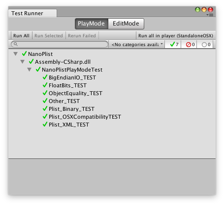

## NanoPlist
NanoPlist is A reader writer for Apple Property Lists (.plist) binary and xml format for C# (C Sharp)
Binary IO is optimized less GC.
 
 Developing by unity.

## Type
NanoPlist use system data type.

|Plist|Type|
|:---|:---|
|Nil|not supported|
|Number(boolean)|bool|
|Number(integer)|int|
|Number(real)|double|
|String|string|
|Date|DateTime|
|Data|byte[]|
|Array|Generic.List&lt;object&gt;|
|Dictionary|Generic.Dictionary&lt;string,object&gt;|

## Testing
data-driven testing like QuickCheck.
NanoPlistProject/Assets/NanoPlistPlayModeTest.cs

## Developing note for binary format
- integer 1, 2, 4 byte is unsigned, 8 is only signed
- dictionary is key, key, key...., value, value, value... order.
- OffsetIntSize can handle all byte for object and offsetTable without trailer. "Not Max OffsetInt Size"

## Acknowledgments
Super good document.

How to decode Apple Binary Property List files
https://synalysis.com/how-to-decode-apple-binary-property-list-files/

Property List/Binary
http://fileformats.archiveteam.org/wiki/Property_List/Binary

Apple Open Source, has any helpfull comment.
https://opensource.apple.com/source/CF/CF-550/CFBinaryPList.c

